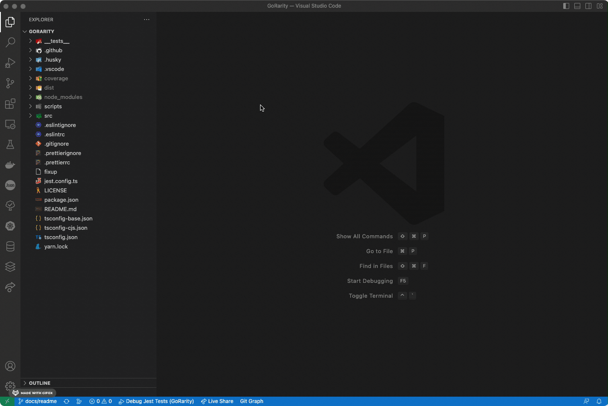
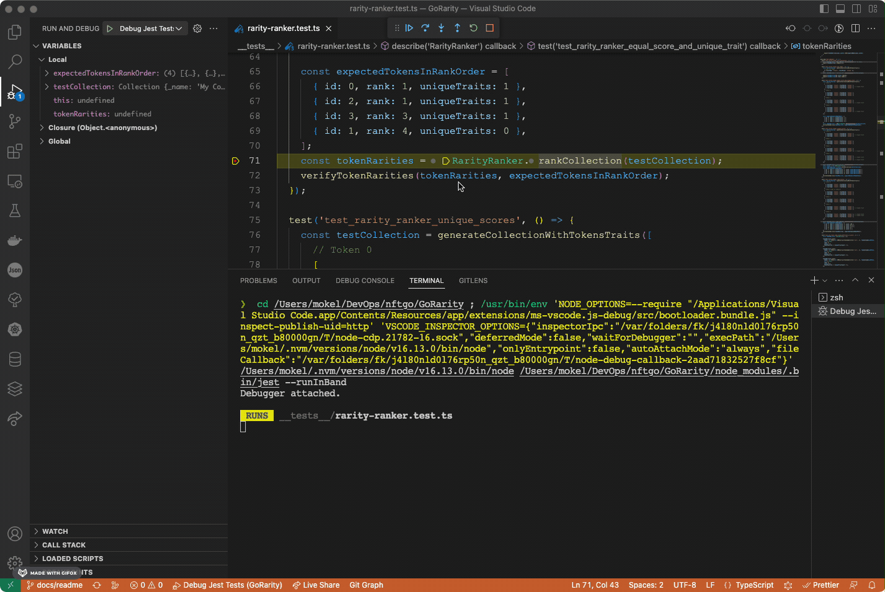

# @NFTGo/GoRarity

An algorithm to calculate the rarity of NFT(how special it is), based on Jaccard Distance.

# Getting started with @nftgo/gorarity

Create Node.js and TypeScript project, then start by installing @NFTGo/GoRarity library in your project using the following command:

```Bash
yarn add @nftgo/gorarity
```

or

```Bash
npm install --save @nftgo/gorarity
```

Then you can use @NFTGo/GoRarity library in your script as follows:

```TypeScript
import {
  Collection,
  EVMContractTokenIdentifier,
  RarityRanker,
  StringTrait,
  Token,
  TokenMetadata,
  TokenStandard,
} from '@nftgo/gorarity';

function script() {
  /**
   * Assemble the traits data into Token object
   */
  const tokens = [
    new Token(
      new EVMContractTokenIdentifier('0xaaa', 1),
      TokenStandard.ERC721,
      new TokenMetadata(
        new Map()
          .set('trait1', new StringTrait('trait1', 'value1'))
          .set('trait2', new StringTrait('trait2', 'value1'))
          .set('trait3', new StringTrait('trait3', 'value1'))
      )
    ),
    new Token(
      new EVMContractTokenIdentifier('0xaaa', 2),
      TokenStandard.ERC721,
      new TokenMetadata(
        new Map()
          .set('trait1', new StringTrait('trait1', 'value1'))
          .set('trait2', new StringTrait('trait2', 'value1'))
          .set('trait3', new StringTrait('trait3', 'value1'))
      )
    ),
    new Token(
      new EVMContractTokenIdentifier('0xaaa', 3),
      TokenStandard.ERC721,
      new TokenMetadata(
        new Map()
          .set('trait1', new StringTrait('trait1', 'value2'))
          .set('trait2', new StringTrait('trait2', 'value1'))
          .set('trait3', new StringTrait('trait3', 'value3'))
      )
    ),
    new Token(
      new EVMContractTokenIdentifier('0xaaa', 4),
      TokenStandard.ERC721,
      new TokenMetadata(
        new Map()
          .set('trait1', new StringTrait('trait1', 'value2'))
          .set('trait2', new StringTrait('trait2', 'value2'))
          .set('trait3', new StringTrait('trait3', 'value3'))
      )
    ),
    new Token(
      new EVMContractTokenIdentifier('0xaaa', 5),
      TokenStandard.ERC721,
      new TokenMetadata(
        new Map()
          .set('trait1', new StringTrait('trait1', 'value3'))
          .set('trait2', new StringTrait('trait2', 'value3'))
          .set('trait3', new StringTrait('trait3', 'value3'))
      )
    ),
  ];

  /**
   * Using rankCollection method to calculate token rarity score and rank tokens according to rarity score.
   */
  const rankedTokens = RarityRanker.rankCollection(new Collection(tokens));

  for (const tokenRarity of rankedTokens) {
    const tokenId = tokenRarity.token.tokenIdentifier.tokenId;
    const rank = tokenRarity.rank;
    const score = tokenRarity.score;
    console.log(`Token ${tokenId} has rank ${rank} score ${score}`);
  }
}

script();
```

You will get the following output in the command line:

```Bash
Token 5 has rank 1 score 100
Token 4 has rank 2 score 62.5
Token 3 has rank 3 score 12.5
Token 1 has rank 4 score 0
Token 2 has rank 4 score 0
```

In addition, we will provide an http service example, which obtains the metadata of NFTs through [NFTGo data-api](https://developer.nftgo.io/) to calculate the rarity of NFTs. This example can be directly used in a prod environment. You only need to prepare an [apiKey](https://developer.nftgo.io/) and a database according to the readme document, and then deploy it.

# Introduction

@NFTGo/GoRarity, the trusted calculation library for NFT rarity, you can provide NFT traits and assemble them into Token Object and Collection Object, then call for RarityRanker's rankCollection method. You will get the return value, which is an array of TokenRarity objects with score, rank and token information sorted by rank. You can follow the example above to try it out.

We use Jaccard distance as the underlying algorithm for the calculation of NFT rarity, you can get more information [here](https://en.wikipedia.org/wiki/Jaccard_index).

The consistency with OpenRarity in key classes, main methods, input parameters and return value is kept so you may easily use @NFTGo/GoRarity when you have used OpenRarity.

You can get more information about the @NFTGo/GoRarity algorithm model from [NFTGo document](https://docs.nftgo.io/docs/introducing-gorarity). If you have any question or suggestion about the algorithm model described in the document, feel free to let us know via [Discord](https://discord.com/invite/nftgo).

# Setup and test locally

You can fork the repository, clone it to the local computer, and execute the `yarn install` command to install the dependencies. Then, you can execute `yarn test` command to run the unit tests, which will yield the following output:

```Bash
yarn run v1.22.19
warning ../../../package.json: No license field
$ jest
 PASS  __tests__/scoring/scoring-handler.test.ts
 PASS  __tests__/scoring/token-feature-extractor.test.ts
 PASS  __tests__/model/collection.test.ts
 PASS  __tests__/model/token.test.ts
 PASS  __tests__/model/token-metadata.test.ts
 PASS  __tests__/rarity-ranker.test.ts
 PASS  __tests__/scoring/scorer.test.ts
--------------------------------------|---------|----------|---------|---------|-------------------
File                                  | % Stmts | % Branch | % Funcs | % Lines | Uncovered Line #s
--------------------------------------|---------|----------|---------|---------|-------------------
All files                             |   94.75 |    77.08 |    88.4 |   95.17 |
 __tests__/utils                      |   78.94 |    42.85 |      40 |   76.47 |
  utils.ts                            |   78.94 |    42.85 |      40 |   76.47 | 5-6,35-36
 src                                  |   96.87 |    85.71 |      80 |   96.42 |
  index.ts                            |     100 |      100 |     100 |     100 |
  rarity-ranker.ts                    |   96.42 |    85.71 |      75 |      96 | 17
 src/models                           |   94.64 |    83.33 |   91.11 |   94.39 |
  collection.ts                       |   97.72 |       90 |   93.75 |   97.67 | 23
  index.ts                            |     100 |      100 |     100 |     100 |
  token-identifier.ts                 |    62.5 |      100 |      40 |    62.5 | 18-34
  token-metadata.ts                   |   94.28 |    66.66 |     100 |   94.11 | 15,65
  token-standard.ts                   |     100 |      100 |     100 |     100 |
  token.ts                            |     100 |      100 |     100 |     100 |
 src/models/utils                     |     100 |      100 |     100 |     100 |
  attribute-utils.ts                  |     100 |      100 |     100 |     100 |
 src/scoring                          |     100 |      100 |     100 |     100 |
  index.ts                            |     100 |      100 |     100 |     100 |
  scorer.ts                           |     100 |      100 |     100 |     100 |
  token-feature-extractor.ts          |     100 |      100 |     100 |     100 |
  utils.ts                            |     100 |      100 |     100 |     100 |
 src/scoring/handlers                 |   96.49 |    78.57 |     100 |     100 |
  index.ts                            |     100 |      100 |     100 |     100 |
  jaccard-distance-scoring-handler.ts |   96.42 |    78.57 |     100 |     100 | 53,66
--------------------------------------|---------|----------|---------|---------|-------------------

Test Suites: 7 passed, 7 total
Tests:       31 passed, 31 total
Snapshots:   0 total
Time:        2.51 s
Ran all test suites.
✨  Done in 4.54s.
```

# Local debugging for test

We provide launch.json file for VSCode so you can get more details about the @NFTGo/GoRarity source code through breakpoint debugging.



# Contributions

If you have any question or suggestion, please submit them to us via [Discord](https://discord.com/invite/nftgo).
